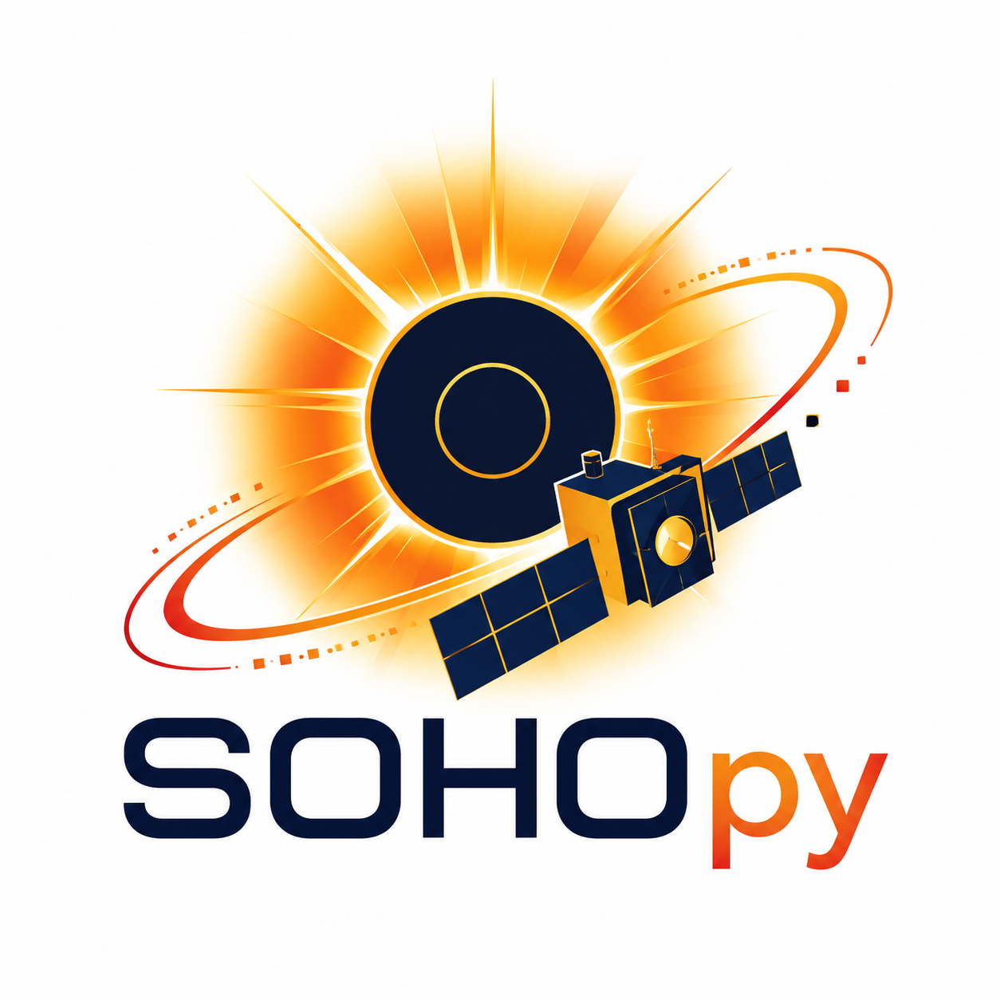

# LASCO Port Status

<p align="center">
  
</p>

This document separates implemented Python ports from routines that require
external SolarSoft dependencies, calibration assets, raw telemetry formats, or
IDL parity output before they can be completed safely.

## Implemented

- `c2_calfactor.pro`: `sohopy.lasco.calibration.c2_calibration_factor`
- `c3_calfactor.pro`: `sohopy.lasco.calibration.c3_calibration_factor`
- `c2_calibrate.pro`: core C2 photometry, exposure/bias hook, and vignetting
- `c3_calibrate.pro`: core C3 photometry, exposure/bias hook, vignetting, mask,
  clear-filter ramp, and polarization-product behavior
- LASCO calibration asset cache/inspection command for the curated Level 1 FITS
  files used by the port
- `ddistim2ecs.pro`: `sohopy.lasco.time.ddis_time_to_ecs`
- `diff2time.pro`: `sohopy.lasco.time.compare_cds_time`
- `inttob32.pro`, `b32toint.pro`, `mb2strmap.pro`, `strmap2mb.pro`:
  `sohopy.lasco.missing_blocks`
- `miss_blocks.pro`: `missing_block_numbers` and header wrapper
- `reduce_statistics.pro`: `add_level05_statistics`
- `reduce_statistics2.pro`: `add_level1_statistics`
- `std_int_scale.pro`: `standard_intensity_scale`
- `check_obesumerror.pro`: `check_obe_summing_error`
- `calc_dark_bias.pro`: computation core via `dark_bias_statistics`
- `get_tel_config.pro`: `telescope_configuration`, with legacy bugs corrected
- `reduce_rectify_p1p2.pro`: `rectify_p1p2`
- `reduce_rectify.pro`: read-port orientation core via `reduce_rectify`
- `make_browse.pro`: uncompressed browse image via `make_browse_image`
- `reduce_level_1.pro`: partial orchestration for calibrated Level 1 products
- Polarization tB/pB: ideal calibrated `-60/0/+60` triplet inversion via
  `sohopy.lasco.polarization`

## Requires IDL Parity Output

These are implemented enough for tests but should be compared against IDL before
being considered scientifically locked:

- `reduce_rectify.pro`: pixel-orientation parity for all read ports and C1
- `reduce_statistics.pro` and `reduce_statistics2.pro`: exact percentile
  histogram behavior
- `make_browse.pro`: exact histogram equalization and JPEG quality loop
- `mb2str/*`: exact orientation of compact missing-block maps
- Polarization: exact `DO_POLARIZ` parity, including `/PTF`, `/VIG`, and C3
  `/FIXC3ZERO` behavior

Generate parity output with:

```bash
scripts/idl/run_lasco_parity.sh tests/fixtures/idl/lasco_parity.json
```

## Blocked By External SolarSoft Routines

These routines are referenced by the LASCO REDUCE code but were not present in
the mirrored help archive:

- `GET_EXP_FACTOR`
- `offset_bias`
- `c2_warp`
- `c3_warp`
- `adjust_hdr_tcr`
- `get_roll_or_xy`
- `get_sun_center`
- `get_sec_pixel`
- `get_solar_radius`
- `read_leb_image`
- `fixwrap`
- `reduce_std_size`
- `lasco_readfits` / `lasco_fitshdr2struct`
- `get_cal_name`
- `update_level1_db`
- `GET_DB_STRUCT` and database insert/update helpers
- `DO_POLARIZ`

The Python package exposes explicit hooks or errors for these instead of
silently substituting approximate behavior.

## Requires Calibration Or Ancillary Data

- `get_crota.pro`: needs nominal roll attitude data.
- `get_cal_dark.pro`, `get_cal_photom.pro`, `get_cal_stray.pro`,
  `get_cal_vignet.pro`, `get_cal_struct.pro`: the modern port uses explicit
  Level 1 FITS calibration assets; exact date/config-table IDL save-set
  selection still needs LASCO calibration tables and current configuration
  files.
- `get_missing_pckts.pro`, `fix_time_jumps.pro`: need packet/missing telemetry
  ancillary files.

## Pipeline Or Side-Effect Routines

These primarily drive old NRL filesystem/database operations. They should become
optional adapters after science parity is complete:

- `reduce_main.pro`
- `reduce_daily.pro`
- `reduce_image.pro`
- `reduce_img_hdr.pro`
- `reduce_transfer.pro`
- `move_reduce_log.pro`
- `write_closed.pro`
- `write_last_img.pro`
- `split_qkl.pro`
- `unpack_reduce_main.pro`

## Raw Telemetry / Level 0.5

The following require packet and LEB image format parity fixtures before a safe
port:

- `reduce_level_05.pro`
- `decode_sc_dacs.pro`
- `unpack_all_science.pro`
- `unpack_lz_science.pro`
- `make_fits_hdr.pro`

## C3 Fuzzy Missing-Block Replacement

The fuzzy routines are mirrored but not yet scientifically ported:

- `fuzzy/dct.pro`
- `fuzzy/fuzzy_block.pro`
- `fuzzy/fuzzy_image.pro`
- `fuzzy/fuzzy_to_num.pro`
- `fuzzy/get_miss_blocks.pro`
- `fuzzy/get_tmask.pro`
- `fuzzy/getl05hdrparam.pro`
- `fuzzy/grad_zone.pro`
- `fuzzy/hcie_zone.pro`
- `fuzzy/inter_fuzzy.pro`
- `fuzzy/num_to_fuzzy.pro`
- `fuzzy/read_block.pro`
- `fuzzy/read_zone.pro`
- `fuzzy/where2d.pro`
- `fuzzy/write_block.pro`
- `fuzzy/write_zone.pro`

These should be ported against IDL fixtures because subtle interpolation,
orientation, and zone-edge decisions affect science pixels.
